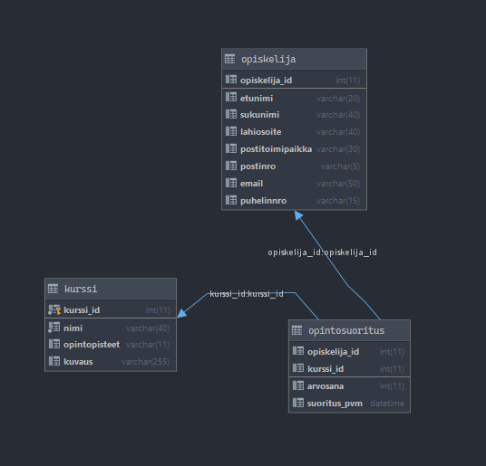

# First year course project for learning about JavaFX and SQL
This was the first project where we combined learned technologies
Also this was the first user interface project.

This project used Java, JavaFX and MariaDB

## Picture of the project

I didn't modify the default JavaFX visual style.

[Repository](https://gitlab.com/juha_airaksinen/userinterfacesql)