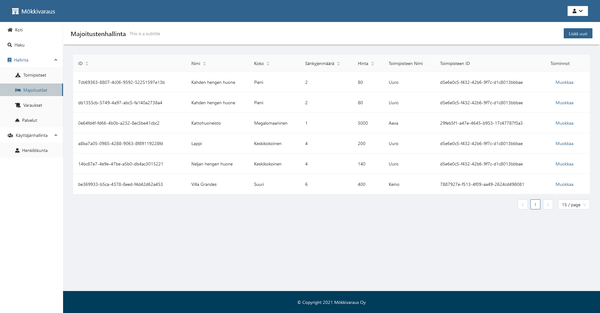

# Project Idea

Our groups project idea was to develop a management tool and a reservation system for the public.

Specifically a set of 2 frontends for different users, one for employees and one for the customers.

## Technology stack

Frontends were developed on ReactJS with TypeScript.
Notably we used ant design components for the project.

The Rest API was done with Loopback the api communicated with a PostgreSQL database.

For practice we got to host the services on Kubernetes, specifically AKS.

## Customer frontend

Capture of the landing page. At the top of the screen the user could search for existing locations and select a time period they would like to make a reservation for.

The search results show the locations possible hotels with the prices and other information.
User can then select their prefered option and hit the reserve button.

After selecting an option the user is prompted to fill out their information for a reservation.

Then when the user has submitted the information they are redirected to the landing page and they will be sent an email about their reservation.

## Staff frontend

The list views contained all the necessary information about a particular field, you could modify and add items.

Each field was sortable and queries were paginated.

While adding items the fields were verified using formik. The user was given options for relations instead of them being freeform.

