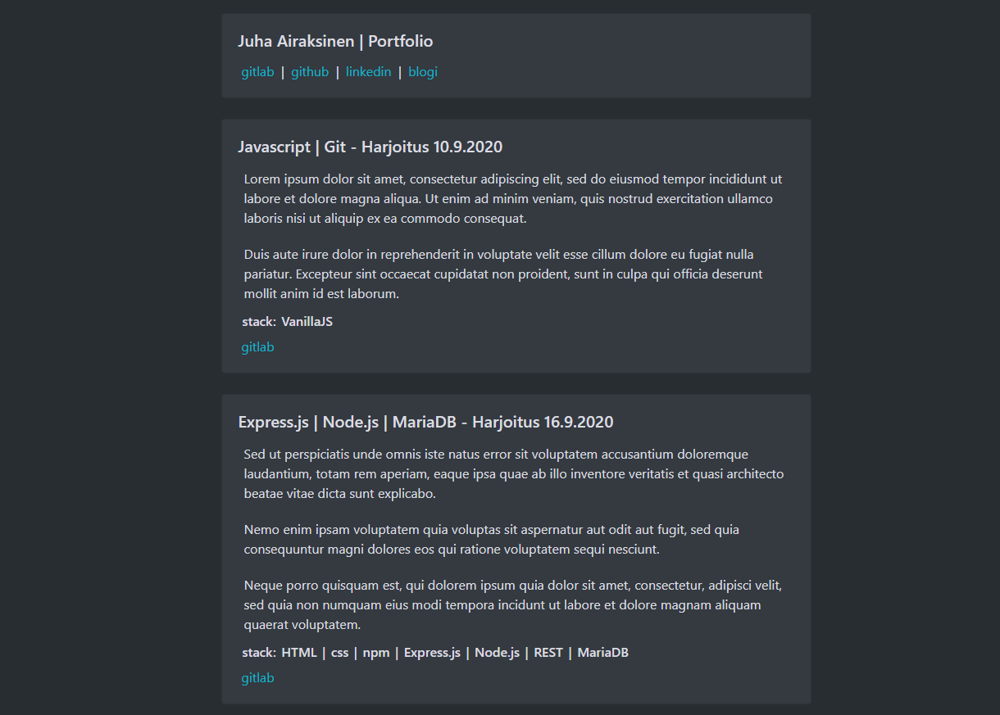

# React and Bootstrap project

This was my first React project using Bootstrap.

Using Bootstrap was a requirement for the assigment, and I think it wasn't needed for the scale of this project.

The subject was to create a portfolio website based on the things learned during the course.
I wanted to later recreate a portfolio website with little more experience and better examples of projects.

## Picture of the project

[Repository](https://gitlab.com/juha_airaksinen/portfolio-kurssi)