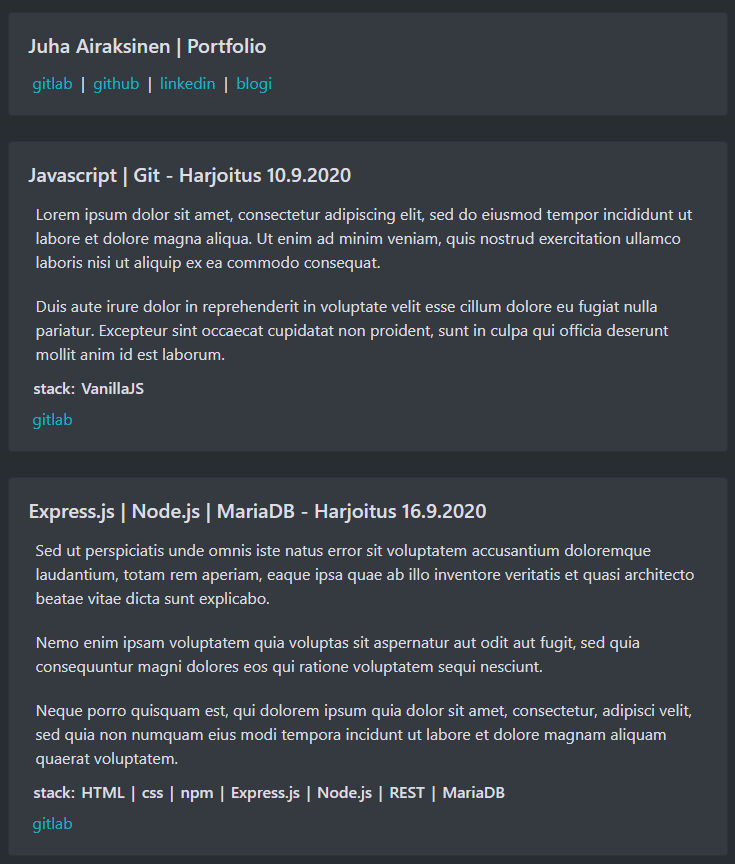

# React ja Bootstrap projekti

Ensimmäinen React pohjainen projekti, jonka aikana opin paljon.

Projektissa täytyi käyttää Bootstrap komponentteja mikä oli mielestäni tarpeetonta tarkoitukseen.

Halusin luoda uuden version blogista paremilla työkaluilla ja käytänteillä myöhemmin.

Käytin projektia inspiraationa tämän portfolion luonnissa.
## Kuva projektista

[Repository](https://gitlab.com/juha_airaksinen/portfolio-kurssi)