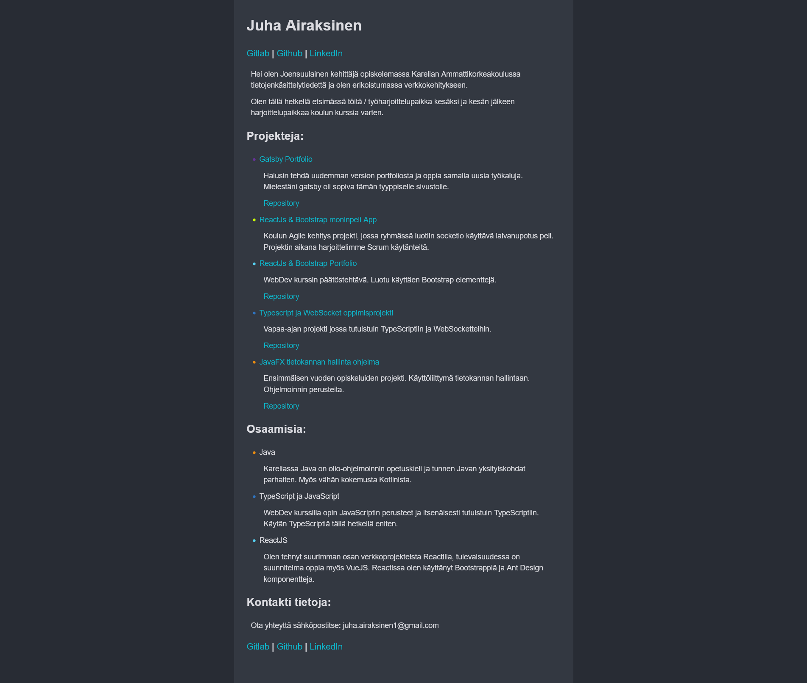

# This portfolio as a project
I started to develop this website on 13.03.2021. 

I had little experience of Gatsby overall, but I wanted to utilize markdown for posts.
Also I had heard that Gatsby performs really well for the content style I was going for.

Also GraphQl is a tech that I thought was interesting to try out. 

It took me roughly one day to get a working version that I could add upon.

I used Github pipelines to deploy it to Heroku which has probably been the most easy deployment I've had so far.

I have been making tweaks to the website, when I have the time, still actively developing it.

Version prior to 17.06.2021 (rework)

[Repository](https://github.com/Zerkath/portfolio-gatsby/)