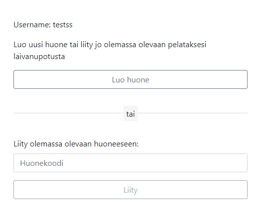

# First webdevelopment group project

During a agile development course our group made a warship game that works on the browser available at the following address:

[https://laivan-upotus.herokuapp.com/](https://laivan-upotus.herokuapp.com/)

We had roughly 6 weeks to develop the product, while also learning how agile works.

Personally I learned how to better utilize React, and I learned about sockets and redux.

## Application views
We had a name picking screen which allowed a user to have a display name. 

After picking a name the player could join a existing room, or they could create a new one.
These rooms were made with sockets, the users aren't able to join full rooms and they also can't create already existing rooms.

The creation prompt allowed the user to pick a name for their room, and they could give the name to their friend to start a game.

After creation the user gets put into a room with 1 free slot.

The game starts when both players have placed down their assigned ships.

After the game ends the users with see the appropriate victory or defeat screens.
The users are returned to the main menu after a game.

The application was intended to also work on mobile to some extent.

